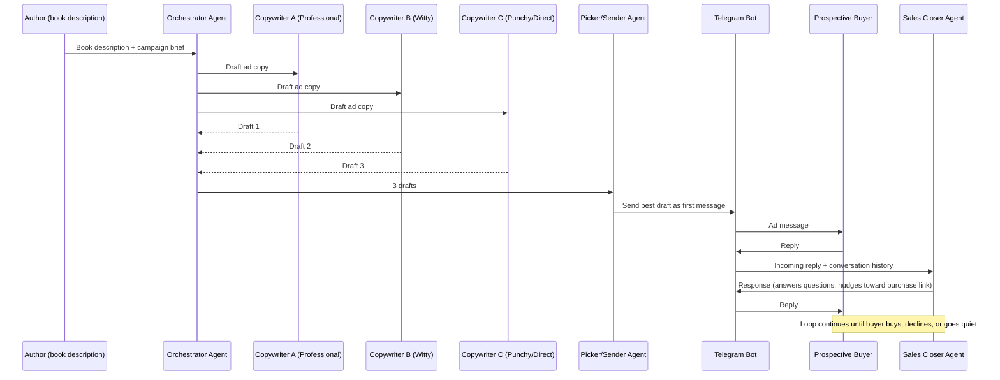

# POC Plan: AI Ad Agency over Telegram

A one-week proof-of-concept that uses orchestration to build an "ad agency"
of agents that pitches an indie author's book to a prospective buyer over
Telegram, and keeps the conversation going to close a sale.

## 1. Goal & Scope

**Goal:** Demonstrate that a multi-agent orchestration (à la the sales-email
lab) can produce ad copy, pick the best variant, send it to a real person via
Telegram, and hold a sales conversation when they reply.

**In scope (POC):**
- One "business" (a single indie book, description supplied by hand or a JSON/YAML file).
- One prospective buyer chatting with one Telegram bot.
- Three copywriter agents with different styles, one picker/sender agent, one conversational "closer" agent.
- Manual QA only — no automated test suite.

**Explicitly out of scope:**
- Multiple businesses/tenants, multi-user concurrency at scale, auth/accounts.
- SendGrid/Resend or any email provider (Telegram replaces email entirely).
- Persistence beyond a simple local store (SQLite/JSON) for conversation state.
- Production concerns: rate limiting, retries/backoff, observability dashboards, deployment pipeline.

## 2. High-Level Flow



## 3. Agent Roster

| Agent | Responsibility | Model tier |
|---|---|---|
| **Orchestrator Agent** | Takes the book description/brief (incl. target reader profile), kicks off the 3 copywriters, hands drafts to the Picker. | Small/cheap model is fine if using Orchestration-by-Code; needs a capable model if Orchestration-by-LLM. |
| **Copywriter A – "Blurb-Professional"** | Back-cover-blurb style: polished, genre-appropriate, comp-title-aware. | Small model |
| **Copywriter B – "Blurb-Witty"** | Hook-first, playful, social-media-ad style. | Small model |
| **Copywriter C – "Blurb-Punchy"** | Short, urgent, trope/CTA-first, reads like a BookTok/BookTube caption. | Small model |
| **Picker/Sender Agent** | Judges the 3 drafts against a rubric (see §6) — scored against the target reader profile — formats the winner as a Telegram message, calls the `send_telegram_message` tool. | Small-medium model |
| **Sales Closer Agent** | Owns the ongoing conversation once the buyer replies: answers questions about the book, discusses tropes/comps the reader cares about, handles objections, shares the purchase link, recognizes buy/no-buy/silence signals — all without being pushy. | Medium model — this one benefits most from a stronger model since it's open-ended dialogue. |

Each agent keeps the same `intro` + style-instructions pattern the lab uses,
just swapped from "sales email" to "book blurb ad" framing, and explicitly
steered **away from literary-fiction prose and toward back-cover-blurb /
marketing copy conventions**, since that's what actually sells a book in a
chat message:

```python
intro = """
You are a copywriter working for an indie author's micro ad-agency.
You write short ads (for a Telegram message) promoting one specific book,
using the target reader profile and book brief below.

Write like a back-cover blurb or a BookTok caption, NOT like literary prose:
hook fast, lean on genre tropes and comp titles the target reader recognizes,
keep sentences short, end with a soft curiosity gap (not a full summary).

Target reader: {target_reader}
Book brief: {book_brief}
"""
instructions_a = intro + "Your style is polished and genre-appropriate — think professional back-cover copy."
instructions_b = intro + "Your style is witty, playful, and meme-aware — think a viral BookTok caption."
instructions_c = intro + "Your style is blunt, urgent, and CTA-first — think a 1-line ad hook."
```

(`{target_reader}` / `{book_brief}` are simple `.format()`/f-string
substitutions from the brief described in §3a — no fine-tuning involved,
just prompt-level tuning as requested.)

## 3a. Book Brief & Target Reader (Input Representation)

Two related questions to answer before writing any agent code: **(1) how do
we describe the target reader**, and **(2) how do we represent the actual
book** (a manuscript you have locally, plus one already published online) so
the agents can sell it well.

### Target reader profile

Add a `target_reader` block to the brief so every agent — copywriters,
picker, and closer — can tailor tone and hooks instead of writing generically:

```json
{
  "target_reader": {
    "age_range": "25-40",
    "reads": ["cozy fantasy", "slow-burn romance"],
    "comp_titles": ["Legends & Lattes", "A Court of Thorns and Roses"],
    "platforms": ["BookTok", "Goodreads"],
    "turn_offs": ["grimdark violence", "cliffhangers with no resolution"]
  }
}
```

This is deliberately just a few fields for the POC — enough to steer the
copywriters' hooks and give the Closer agent something concrete to react to
("since you like slow-burn romance, you'll enjoy..."), without building a
full persona/segmentation system.

### Representing the book itself

Don't feed agents the full manuscript text as the primary selling material —
it's long, it eats context/cost on every call, and raw manuscript prose is
not ad copy. Instead, build a **`book_brief.json`** (or `.yaml`) that is the
single source of truth all agents read from:

```json
{
  "title": "...",
  "author": "...",
  "genre": "cozy fantasy",
  "tropes": ["found family", "enemies to lovers", "cozy small-town setting"],
  "one_line_pitch": "...",
  "back_cover_blurb": "...",
  "sample_excerpt": "first ~300 words, for the Closer to quote if asked",
  "purchase_link": "https://...",
  "published_online_url": "https://...",
  "length_pages_or_words": 320,
  "content_notes": ["mild language", "no graphic violence"]
}
```

- **`back_cover_blurb`** and **`one_line_pitch`**: write these yourself (or
  have a one-off agent draft-and-you-edit them) as the primary marketing
  material — this is what the copywriters remix into ad variants, not the
  manuscript.
- **`sample_excerpt`**: a short, curated excerpt (not the whole manuscript)
  the Closer agent can quote if a buyer asks "can I see a sample?" — links to
  `published_online_url` for anyone who wants the full read.
- **`tropes`**: explicit list, since trope-matching (§ below) is how the
  Closer sells without being salesy — "if you liked X, this has Y trope" reads
  as helpful, not pushy.
- Keep the full manuscript file on disk for reference, but don't put it in
  any agent's context by default — only the Closer, and only the
  `sample_excerpt` field, needs book text at all.

### Tuning the Closer to sell tropes without being pushy

Since there's no fine-tuning in scope, this is entirely prompt work:

```python
closer_instructions = f"""
You are a friendly bookseller chatting on Telegram about "{book_brief['title']}".
You know the book's tropes: {book_brief['tropes']}.
You know the target reader likes: {target_reader['reads']} and comp titles
{target_reader['comp_titles']}.

Rules:
- Talk about tropes and comp titles like a fellow reader recommending a book,
  not like a salesperson reciting features.
- Never use pressure tactics (no "limited time", no repeated asks to buy).
- Answer questions honestly, including content notes if asked.
- Only mention the purchase link when the reader signals genuine interest,
  or if they ask directly where to get it.
- If the reader goes quiet or declines, do not chase — end warmly.
"""
```

## 4. Orchestration Pattern: Code vs. LLM

The lab shows both. For this POC, split the decision by phase:

### Phase A — Draft → Pick → Send (initial ad creation)

| | **Orchestration by Code** | **Orchestration by LLM** |
|---|---|---|
| **Pros** | Deterministic, cheap, fast; easy to debug (`asyncio.gather` + explicit picker call); no risk of the "manager" agent skipping a step or forgetting to call a tool; trivial to log/trace each stage. | More flexible if you later want the orchestrator to *decide* how many drafts to request, retry a weak draft, or change strategy mid-flight; less glue code to maintain as complexity grows. |
| **Cons** | Less flexible — every change in flow requires code changes; no adaptive re-drafting if all 3 outputs are weak. | Slower and more expensive (extra LLM call just to orchestrate); flakier — the lab itself notes tool-forcing was needed to get reliable sends; harder to debug when the manager "forgets" a step. |
| **Recommendation** | **Use Orchestration by Code** for Phase A. This step is a fixed, well-known pipeline (3 parallel drafts → pick → send) with no need for dynamic reasoning about *what to do next* — only *which draft is best*, which the Picker agent still handles via LLM judgment. Matches the 1-week timeline: less code, more reliable demo. |

### Phase B — Ongoing sales conversation (buyer replies)

This phase is inherently open-ended (the buyer can ask anything, in any
order), which is exactly the case where an LLM-driven agent shines over
hard-coded branching logic.

- **Recommendation:** the Sales Closer is a single conversational agent
  (not a hand-off chain) that receives the full thread history each turn and
  decides how to respond. No orchestration pattern needed here beyond
  "one agent, looped by the Telegram webhook/poller." This sidesteps the
  handoff unreliability the lab explicitly warns about.

**Overall recommendation:** hybrid — **Code orchestration** for the
deterministic draft/pick/send pipeline, and a **single stateful agent**
(no orchestration needed) for the reactive sales conversation. This avoids
the LLM-orchestration flakiness noted in the lab for both phases, while
still using agents-as-tools where it adds real value (the Picker calling
a `send_telegram_message` tool, same shape as `send_email_tool` in the lab).

## 5. Telegram Integration (replaces SendGrid/Resend)

You already have a Telegram bot, which simplifies Day 1 considerably — no
need to create one via BotFather, just reuse its existing token.

- **Reuse your existing bot:** grab its token from BotFather (`/mybots` →
  your bot → API Token) and put it in `.env` as `TELEGRAM_BOT_TOKEN`. If the
  bot currently has a webhook set from a prior project, call
  `deleteWebhook` once before using long polling, otherwise `getUpdates`
  will silently return nothing.
- Use `python-telegram-bot` (or raw `requests` against the Bot API — simplest
  for a POC, mirrors the lab's SMTP-via-`smtplib` simplicity).
- **Outbound:** `send_telegram_message(chat_id, text)` tool, same
  `@function_tool` pattern as `send_email_tool` in the lab.
- **Inbound:** simplest POC option is **long polling** (`getUpdates`) in a
  small loop/thread — no public URL/webhook/ngrok needed, which matters for
  a 1-week solo build. If you deploy the app online (see §12), switching to
  a webhook becomes trivial since you'll have a public URL anyway.
- **Chat identity:** for the POC, one hardcoded `chat_id` (the dev's own
  Telegram test account) is enough — no need for a buyer directory/db. The
  `chat_id` is easiest to grab by sending your bot one message and reading it
  back from `getUpdates`.
- **Conversation state:** append each inbound/outbound message to a simple
  JSON file or SQLite table keyed by `chat_id`, passed as context to the
  Closer agent each turn (mirrors `Runner.run(agent, message)` but with
  accumulated history instead of a single string).
- **Sanity check before Day 2:** since the bot already exists, spend the
  first hour of Day 1 just confirming `send_telegram_message` and
  `getUpdates` round-trip correctly with your real bot/chat before writing
  any agent code — this de-risks the one external dependency you don't
  control.

## 6. Picker Rubric (keep it simple)

Reuse the lab's `sales_picker` instructions almost verbatim, adapted:

```python
decision = f"""
You pick the best ad from the given options for a Telegram message
promoting an indie book, for this target reader: {target_reader}.
Imagine you ARE that reader and pick the one you are most likely to tap
and respond to. Consider: hook strength, relevance to the target reader's
tastes/comp titles, clarity, and whether it fits a short chat message
(not an email, not literary prose).
Do not give an explanation; reply with the selected ad only.
"""
```

## 7. Suggested File Structure

```
telegram_ad_agency_poc/
  PLAN.md                   <- this file
  app.py                    <- entrypoint: loads book brief, runs Phase A, starts Phase B poller
  agents_defs.py            <- Orchestrator, Copywriters, Picker, Closer agent definitions
  telegram_tools.py         <- send_telegram_message tool + polling loop for inbound messages
  conversation_store.py     <- tiny JSON/SQLite helper for chat history
  book_brief.example.json   <- sample book brief: blurb, tropes, comp titles, sample_excerpt, links (see §3a)
  target_reader.example.json<- sample target reader demographic/taste profile (see §3a)
  manuscript/               <- optional: your full manuscript kept on disk for reference only,
                                not loaded into agent context by default
  .env.example               <- TELEGRAM_BOT_TOKEN, OPENAI_API_KEY, etc.
```

## 8. One-Week Timeline (solo dev)

| Day | Work |
|---|---|
| **Day 1** | Repo scaffold, `.env`/config using your existing Telegram bot token; delete any stale webhook; verify `send_telegram_message` + long-polling `getUpdates` round-trip working manually; draft `book_brief.json`/`target_reader.json` from your manuscript + published book (see §3a). |
| **Day 2** | Port the 3 copywriter agents + Orchestrator (code-based `asyncio.gather`) from the lab; adapt prompts to "book ad" framing; manual QA on draft quality. |
| **Day 3** | Build Picker agent + `send_telegram_message` tool; wire Phase A end-to-end: brief in → best ad sent to Telegram. |
| **Day 4** | Build conversation store + inbound polling loop; stub Sales Closer agent that just echoes/acks replies; confirm the loop (buyer reply → agent sees it → agent responds) works. |
| **Day 5** | Flesh out Sales Closer prompt: answer FAQs about the book, handle objections, share a purchase link, detect buy/decline/ghost signals; manual QA with a few scripted buyer personas (interested, skeptical, price-sensitive). |
| **Day 6** | End-to-end manual QA of the full flow (brief → 3 drafts → pick → send → reply → close); fix rough edges; add basic tracing (`with trace(...)`) for debuggability, same as the lab. |
| **Day 7** | Buffer day: polish prompts, record a demo run/trace, write a short README on how to run it, capture "known limitations" for the next iteration. |

## 9. Manual QA Checklist (no automated tests)

- [ ] Given a sample book brief, all 3 copywriters return non-empty, on-style drafts.
- [ ] Picker consistently returns exactly one of the 3 drafts (spot-check 5 runs).
- [ ] The picked ad arrives in Telegram formatted readably (no raw JSON/markdown artifacts).
- [ ] Replying in Telegram triggers the Closer agent within a few seconds.
- [ ] Closer agent references facts from the book brief correctly (no hallucinated details).
- [ ] Closer agent shares the purchase link when the buyer signals interest.
- [ ] Conversation history persists across multiple back-and-forth turns in one run of the app.
- [ ] Check `platform.openai.com/traces` after each run, same habit as the lab.

## 10. Risks / Known Limitations (carried into README)

- Long polling is not production-grade (no scaling, no multi-chat concurrency) — fine for POC.
- No retry/error handling around Telegram API calls — a flaky network call could drop a message.
- Single hardcoded `chat_id`/single business — nothing here validates multi-tenant behavior.
- No automated tests; regressions are only caught by manual QA per §9.
- LLM-judged picker and closer are non-deterministic — expect to iterate on prompts, exactly as the lab warns for orchestration-by-LLM.

## 11. Stretch Goals (post-POC, not part of the 1-week scope)

- Swap long polling for a Telegram webhook.
- Support multiple businesses/books via a config directory instead of one brief.
- Add a lightweight admin view of active conversations.
- Real payment/purchase-link tracking (did the buyer actually click/buy?).

## 12. Deployment Options for a Live Demo

The app has two moving pieces that need to run somewhere reachable: the
Telegram inbound loop (polling or webhook) and the agent/tool code that
calls OpenAI. For a 1-week solo POC, prioritize **fastest to a working demo
URL** over production-readiness.

| Option | How it works | Pros | Cons | Fit for this POC |
|---|---|---|---|---|
| **Keep long polling, run on your own machine** | `app.py` runs a loop calling `getUpdates`; no public URL needed at all. | Zero deployment work; matches §5 exactly; cheapest. | Only "live" while the process runs; not shareable as a hosted demo unless you leave a machine on. | Good for internal dev/demo recording, not for a link you hand to someone else. |
| **Single small VM (e.g. a $5-6/mo DigitalOcean/Linode/Hetzner box, or a free-tier AWS/GCP VM)** | SSH in, `git pull`, run the script, keep it alive with `systemd`/`tmux`/`pm2`. | No webhook/HTTPS/domain needed since it's still polling; simple mental model; cheap; full control. | You own patching/uptime; no auto-restart unless you set up a process manager. | Best balance of simplicity and "actually always on" for a demo you can point people to. |
| **PaaS background worker (Railway, Render, Fly.io)** | Deploy as a "worker" service (not a web service), still using long polling — most of these platforms support a non-HTTP background process. | Push-to-deploy, free/cheap tiers, no server maintenance, easy env var management for `TELEGRAM_BOT_TOKEN`/`OPENAI_API_KEY`. | Free tiers may sleep/spin down background workers on some platforms — check before relying on it for a live demo. | Recommended if you want a "real" deployment with minimal ops work; Render and Railway both have straightforward background-worker support. |
| **Webhook + small web service (Render/Fly/API Gateway+Lambda)** | Telegram calls your public HTTPS endpoint on each message instead of polling; requires a small FastAPI/Flask endpoint. | More "production-shaped"; no polling loop to keep alive; scales trivially. | More setup: needs HTTPS endpoint, `setWebhook` call, request validation; overkill for a 1-week POC per §5's own recommendation. | Only worth it if you're already deploying a web service anyway — otherwise stick with polling. |
| **Full container deployment (Docker + Fly.io/Render/ECS)** | Containerize `app.py`, deploy as a long-running service. | Reproducible, portable, easy to hand off later. | Extra Docker setup time you likely don't need for a 1-week POC. | Stretch goal, not Day-1-7 scope. |

**Recommendation:** build and manually QA the whole flow on your own machine
per §5 (Days 1–6), then on Day 7 push it to a small always-on VM or a PaaS
background worker (Railway/Render) so you have a shareable, continuously
running demo — no webhooks/HTTPS needed, just relocating the same polling
loop from §5 to run somewhere always-on.
